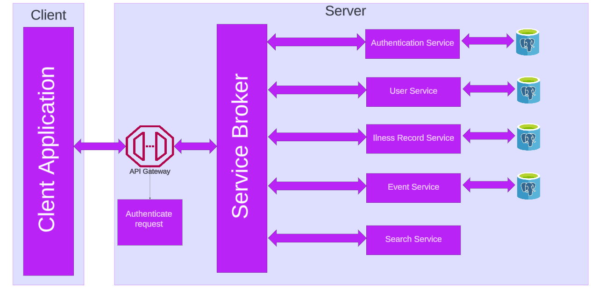
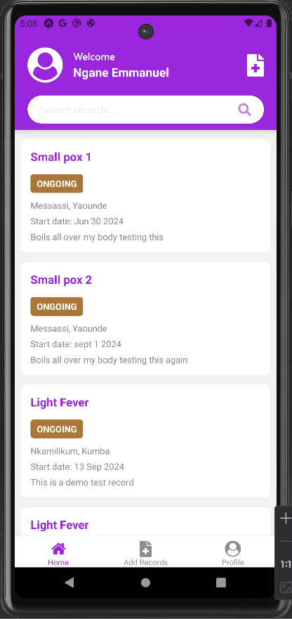
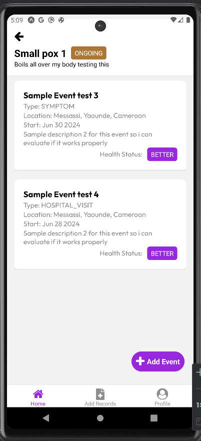
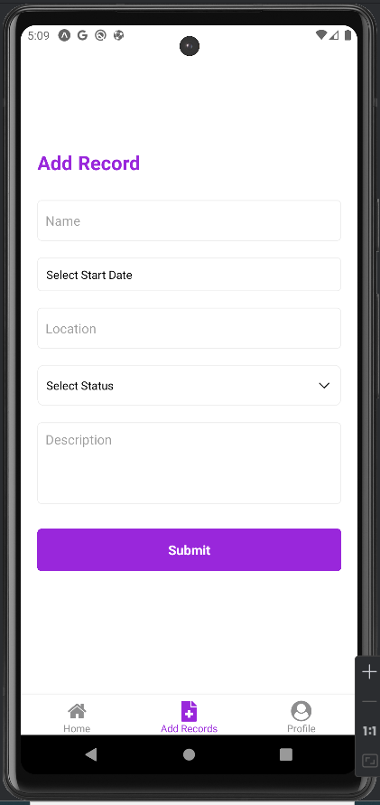
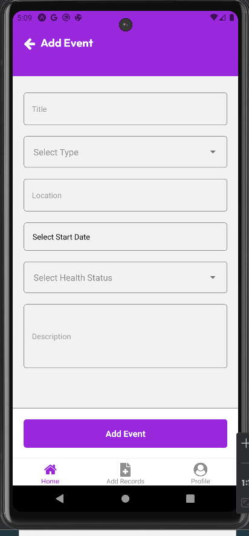
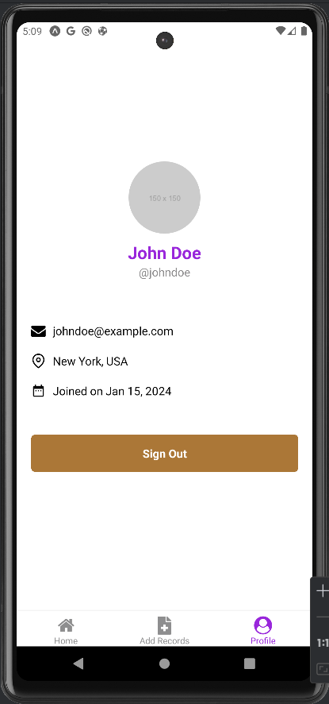
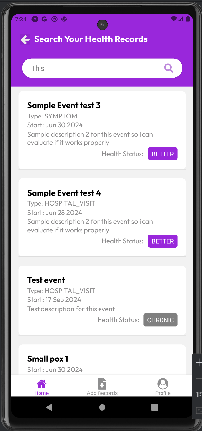

# GetHealthy - Health Records Registry Application

 <!-- Replace this with your logo if available -->

## Overview

**GetHealthy** is a comprehensive personal health records management application designed to allow users to record and monitor their medical history. With a robust, microservices-based backend and a user-friendly mobile interface, this app makes it easy for users to track their health and manage medical events efficiently.

This project leverages modern web technologies to deliver a secure, scalable, and responsive platform that caters to individuals and healthcare providers.

## Features

- **User-friendly interface** to manage health records and monitor medical history.
- **Authentication** using Clerk for user management and session control.
- **Event-based health tracking**, enabling users to add and view medical events such as doctor visits, treatments, and tests.
- **Microservices architecture**, ensuring scalability, reliability, and separation of concerns.
- **Stateless services** for authentication and searching through records.
- **Responsive design**, making the application accessible on both mobile devices and desktops.
- **Secure**: Data is encrypted and protected, with each service having its own database.

## Architecture

The application uses a **N-tier microservices architecture** with the following components:

1. **Client Side**: Built using **React Native** and **Expo** for a smooth mobile experience.
2. **Backend Services**:
   - **Spring Boot microservices** for handling user data, health records, authentication, and more.
   - **API Gateway** for routing requests and handling service orchestration.
   - **PostgreSQL** databases for storing user and event data.
   - **Service Registry** for service discovery.
3. **Devops**: used Git and GitGub for continuous integration, Decker for continuous delivery and containerization.
   
### Diagram Placeholder
This project makes use of the microservice architecture, where every functionality is extracted into its own microservice. All services communicate using the service broker, and all but stateless services (search services) maintain their separate databases.
 <!-- Replace with your architecture diagram -->

## Technology Stack

- **Frontend**: React Native, Expo
- **Backend**: Spring Boot (Microservices), API Gateway
- **Database**: PostgreSQL
- **Authentication**: Clerk
- **Hosting**: local Machine
- **Containerization**: Docker, Docker Compose

## Screenshots

### Home Screen
 <!-- Add your screenshot here -->

### Event Management
 <!-- Add your screenshot here -->

### Health Records
 <!-- Add your screenshot here -->

### Add Events


### Profile Screen


### Search Records


## Setup Instructions

### Prerequisites

- **Node.js** (>= 14.x)
- **Java >= 21**
- **PostgreSQL** (one instance per service)
- **Docker** and **Docker Compose**
- **Expo CLI**

### Backend Setup

1. Clone the repository:
   ```bash
   git clone https://github.com/NganeEmmanuel/HospitalBook.git
   cd gethealthy
   ```

2. **Docker Setup**:
   ```bash
   docker-compose up
   ```

3. **Running the Backend Locally**:
   For each microservice:
   ```bash
   cd service-name
   ./mvnw spring-boot:run
   ```

### Frontend Setup

1. Install dependencies:
   ```bash
   cd GetHealthy
   npm install
   ```

2. Start the Expo development server:
   ```bash
   expo start
   ```

3. Run on your device (Android/iOS) via the Expo Go app.

## Usage

1. **User Authentication**: Sign up or log in. You can add your personal details and manage your health records securely.
2. **Add Health Events**: Record health events such as doctor visits, medications, surgeries, and more. You can view and update these events over time.
3. **Health Status Monitoring**: Track your health over time and visualize trends in your medical history.

## Contributing

We welcome contributions! Please follow these steps:

1. Fork the repository.
2. Create a new feature branch.
3. Commit your changes.
4. Submit a pull request.

## License

This project is licensed under the MIT License. See the [LICENSE](LICENSE) file for details.

---

Let me know if you need any adjustments or additional sections added!
